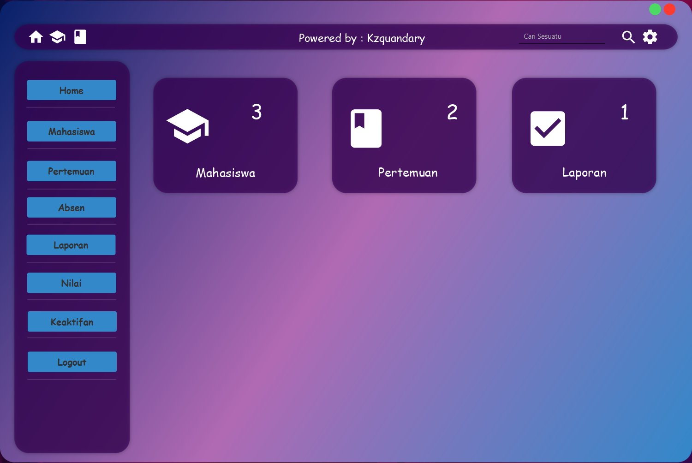
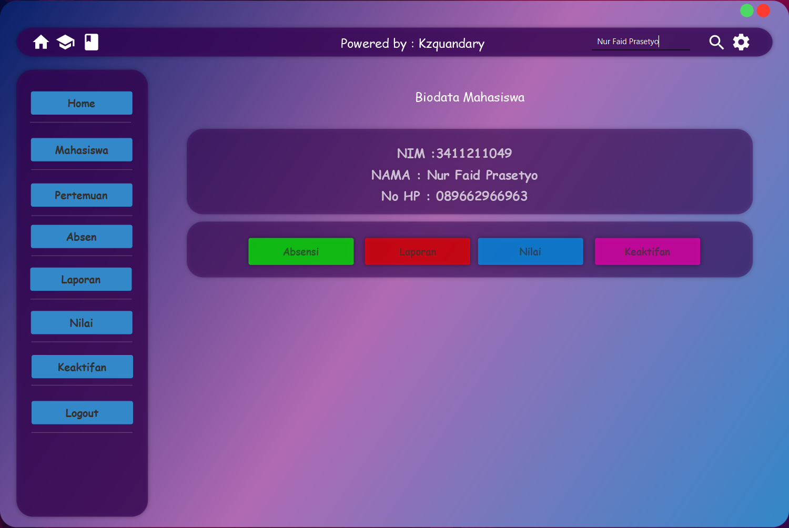

  
  <h1>Laboratory Assistant Attendance with JavaFX Maven</h1>
  

    Project Tugas Besar Pemrograman Objek 2 Informatika Universitas Jenderal Achmad Yani
  

  
<!-- Badges -->

  
  
  
  
  

 

<!-- Table of Contents -->

  <h2> 📔 Project Roadmap </h2>

    ┌── Project Aslab APP
    │   ├── Home [✅] 05/11/2023
    │   │   ├── Views [✅] 05/11/2023
    │   │   └── Controller [✅] 05/11/2023
    │   ├── Search [✅] 05/13/2023
    │   │   ├── Views [✅] 05/11/2023
    │   │   └── Controller [✅] 05/11/2023
    │   │       ├── Pencarian NIM [✅] 05/11/2023
    │   │       ├── Pencarian Nama [✅] 05/11/2023
    │   │       ├── Pencarian No HP [✅] 05/11/2023
    │   │       ├── Tabel Absensi [✅] 05/12/2023
    │   │       ├── Tabel Laporan [✅] 05/13/2023
    │   │       ├── Tabel Nilai [✅] 05/13/2023
    │   │       └── Tabel Keaktifan [✅] 05/13/2023
    │   ├── Mahasiswa [✅] 05/11/2023
    │   │   ├── Views [✅] 05/11/2023
    │   │   ├── Model [✅] 05/11/2023
    │   │   └── Controller [✅] 05/11/2023
    │   │       ├── Create [✅] 05/11/2023
    │   │       ├── Read [✅] 05/11/2023
    │   │       ├── Update [✅] 05/11/2023
    │   │       └── Delete [✅] 05/11/2023
    │   ├── Pertemuan
    │   │   ├── Views
    │   │   ├── Model [✅] 05/11/2023
    │   │   └── Controller
    │   │       ├── Create
    │   │       ├── Read
    │   │       ├── Update
    │   │       └── Delete
    │   ├── Absensi
    │   │   ├── Views
    │   │   ├── Model [✅] 05/13/2023
    │   │   └── Controller
    │   │       ├── Create
    │   │       ├── Read
    │   │       ├── Update
    │   │       └── Delete
    │   ├── Laporan
    │   │   ├── Views
    │   │   ├── Model [✅] 05/13/2023
    │   │   └── Controller
    │   │       ├── Create
    │   │       ├── Read
    │   │       ├── Update
    │   │       └── Delete
    │   ├── Nilai
    │   │   ├── Views
    │   │   ├── Model [✅] 05/13/2023
    │   │   └── Controller
    │   │       ├── Create
    │   │       ├── Read
    │   │       ├── Update
    │   │       └── Delete
    │   └── Keaktifan
    │       ├── Views
    │       ├── Model [✅] 05/13/2023
    │       └── Controller
    │           ├── Create
    │           ├── Read
    │           ├── Update
    │           └── Delete
    └── Finishing Project
    

  <h2> 📷: Screenshoot </h2>

 
  

 
  

